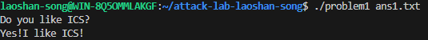
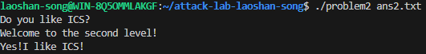
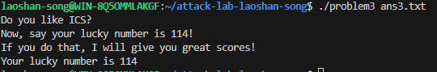
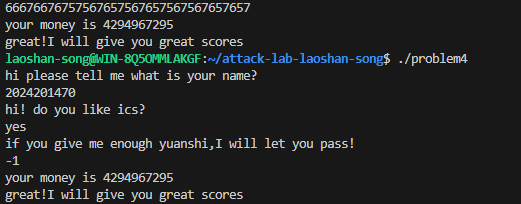

# 栈溢出攻击实验

## 题目解决思路

### Problem 1: 
- **分析**：func 函数中定义了一个缓冲区（buffer），其位于栈上的位置是 rbp-0x8。函数使用了不安全的输入函数（如 fread/strcpy），没有检查输入长度。 目标函数 func1 的地址为 0x401216，该函数会输出 "Yes!I like ICS!"。 
由于没有开启保护，只需要填充缓冲区并覆盖栈底指针（Saved RBP），最后将返回地址覆盖为 func1 的地址即可
- **解决方案**：Linux printf 命令构造 Payload，包含 16 个 'A' 作为填充，随后紧跟 func1 的小端序地址。Address: 0x401216
- **结果**：

### Problem 2:
- **分析**：NX (No-Execute) 保护，意味着无法在栈上执行 Shellcode。 目标函数 func2 存在参数检查（cmp [rbp+x], 0x3F8）
直接将返回地址修改为 0x40124C，绕过参数检查,与 Problem 1 类似，func 中的 Buffer 位于 rbp-0x8，填充长度依然为 16 字节。
- **解决方案**：跳转到“成功分支”地址 0x40124C:printf "AAAAAAAAAAAAAAAA\x4c\x12\x40\x00\x00\x00\x00\x00" > ans2.txt Target Address: 0x40124C
- **结果**：附上图片

### Problem 3: 
- **分析**：本题目标是打印幸运数字 114。func1 同样有参数检查,尝试直接跳转到打印逻辑的地址 0x40122B。
 难点：func1 的打印逻辑中包含 mov qword ptr [rbp+buffer1], rax，这依赖于 rbp 寄存器指向一个可写的内存区域。由于溢出攻击覆盖了 Saved RBP，如果将其覆盖为无效值（如 'AAAA'），程序在写入时会发生 Segmentation Fault。 
 策略：我们需要伪造 RBP (Stack Pivoting/Fake RBP)。通过 objdump -h 找到 .data 段的起始地址 0x4034E0（可读写区域），将 Saved RBP 覆盖为该区域的一个安全地址（如 0x403550），使程序能正常写入数据而不崩溃。 计算偏移量： Buffer 位于 rbp-0x20 (32字节)。
- **解决方案**：填充(32字节) + 伪造的 RBP (.data段) + 目标地址:printf "AAAAAAAAAAAAAAAAAAAAAAAAAAAAAAAA\x50\x35\x40\x00\x00\x00\x00\x00\x2b\x12\x40\x00\x00\x00\x00\x00" > ans3.txt
- **结果**：

### Problem 4: 
- **分析**：通过反汇编 main 函数可以看到，程序在栈分配后立即执行了 v7 = __readfsqword(0x28u);
这条指令从 fs 段寄存器偏移 0x28 处读取一个随机生成的 64 位数值（Canary/Cookie），并将其放置在局部变量和返回地址之间。在函数返回前，程序会再次检查该值是否被修改（xor 操作）。
如果发生缓冲区溢出覆盖了 Canary，程序会报错
- **解决方案**：反编译显示代码将输入作为有符号数读取，并与 -200000096 相关的逻辑进行比较，但输出提示显示其被解释为无符号数 (%u)。直接输入-1为无符号最大整数即可
- **结果**：附上图片

## 思考与总结
本次实验从基础的栈溢出开始，逐步深入到绕过 NX 保护和处理栈帧破坏问题，最后通过逻辑漏洞绕过 Canary 保护。

栈溢出核心：理解栈帧结构（Buffer -> Saved RBP -> Return Address）是所有攻击的基础。

Ret2Text：在开启 NX 保护时，利用程序自身的代码片段是极其有效的手段，可以跳过不需要的检查逻辑。

栈环境控制：在 Problem 3 中深刻体会到了 RBP 的重要性，单纯控制 RIP 是不够的，还需要确保栈指针指向合法的可写内存（如 .data/.bss），防止程序后续执行崩溃。

安全不仅仅是内存安全：Problem 4 展示了即使有完善的内存保护（Canary），代码逻辑上的整数符号问题（Signed/Unsigned Mismatch）依然会导致系统被攻破。

## 参考资料

cs-app attacklab 实验详解-知乎https://zhuanlan.zhihu.com/p/410418053
